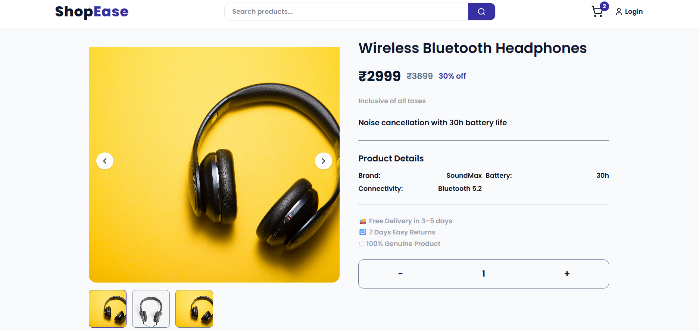

# 🛍️ ShopEase – Production-Ready Full Stack E-Commerce Platform

Shopeease is a scalable full-stack e-commerce application designed to simulate a real-world online shopping system.
It demonstrates secure authentication, structured database design, optimized API architecture, payment workflow, and production deployment practices.

Built as a portfolio-level project to reflect industry standards.

### 🌐 Live Application

🔗 Live Frontend: https://shoopease.vercel.app/

🔗 Backend API: https://cartify-jyrg.onrender.com

### 🏗️ System Architecture

Shopeease follows a client-server architecture:

```
Client (React)
        ↓
REST API (Express.js)
        ↓
Prisma ORM
        ↓
PostgreSQL Database
```

### Architecture Highlights

- Separation of concerns (controllers, routes, middleware)
- Stateless authentication using JWT
- Centralized error handling middleware
- ORM-based relational data management
- Environment-based configuration

### 🧠 Tech Stack

##### Frontend

- React.js
- React Router
- Axios
- Tailwind CSS 
- Context API / Custom Hooks

#### Backend

- Node.js
- Express.js
- Prisma ORM
- PostgreSQL

#### DevOps & Deployment

- Vercel (Frontend)  
- Backend hosted on Render  
- Environment variable management  
- CORS configuration

### ✨ Core Features

#### 👤 Authentication & Authorization

- Secure user registration
- Hashed passwords
- JWT-based login
- Protected routes (frontend & backend)
- Role-based access ready (extendable)

#### 🛍️ Product Management

- Fetch all products
- Product detail page
- Dynamic image gallery
- Review count & rating system

#### 🛒 Cart System

- Add to cart
- Update quantity
- Remove item
- Persistent cart linked to user

#### ⭐ Reviews & Ratings

- Authenticated users only
- Linked relational data
- Real-time update after submission

#### 📦 Order Management

- Create order
- Order summary
- Order detail page
- Status tracking (extendable)

#### 💳 Payment Integration

- Payment processing flow
- Order confirmation after payment
- Status update in database

### 📡 API Documentation (Core Endpoints)

#### 🔐 Auth Routes

```
POST   /api/auth/register
POST   /api/auth/login
GET    /api/auth/profile
```

#### 🛍️ Product Routes

```
GET    /api/products
GET    /api/products/:id
POST   /api/products (Protected)
```

#### ⭐ Review Routes

```
POST   /api/reviews/:productId (Protected)
GET    /api/reviews/:productId
```

#### 🛒 Cart Routes

```
GET    /api/cart
POST   /api/cart
PUT    /api/cart/:id
DELETE /api/cart/:id
```

#### 📦 Order Routes

```
POST   /api/orders
GET    /api/orders
GET    /api/orders/:id
```

### 🗄️ Database Schema Overview

#### Main relational entities:

- User
- Product
- Review
- Cart
- Order
- OrderItems

### Relationships:

- One User → Many Orders
- One Product → Many Reviews
- One Order → Many OrderItems
- One User → One Cart

#### ORM: 
- Prisma

#### Migration Strategy: 

```
npx prisma db push
```

### 📂 Folder Structure

#### backend/

```
│── controllers/
│── routes/
│── middleware/
│── prisma/
│── config/
│── server.js
```

#### frontend/

```
│── components/
│── pages/
│── hooks/
│── context/
│── utils/
│── App.jsx
```

### 📸 Screenshots

## Home Page


## Product Page



## Cart


### ⚙️ Local Development Setup

#### Clone Repository

```
git clone https://github.com/yourusername/shopeease.git
```

#### Backend Setup

```
cd backend

npm install

Run Prisma:

npx prisma generate

npx prisma db push

```

#### Start server:

```
npm run dev

```

#### Frontend Setup

```
cd frontend
npm install
npm run dev

```

### 🛡️ Security Measures

- Password hashing
- JWT verification middleware
- Protected backend routes
- Input validation
- CORS restrictions
- Environment-based config separation

### 📈 Performance Considerations

- Optimized relational queries with Prisma
- Minimal state re-renders in React
- Efficient REST structure
- Clean middleware layering
- Lazy component loading (extendable)

### 🚧 Future Enhancements

- Admin dashboard
- Advanced filtering & sorting
- Wishlist system
- Stripe production-grade integration
- Email order confirmation
- Caching
- Product search optimization

### 👨‍💻 Author

**Nikhil Singh Kaintura**
